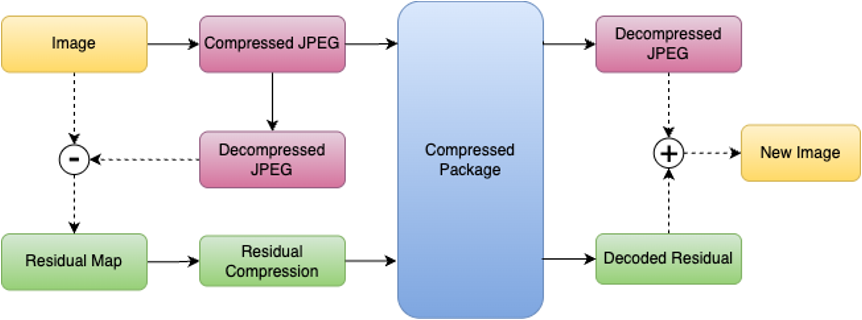
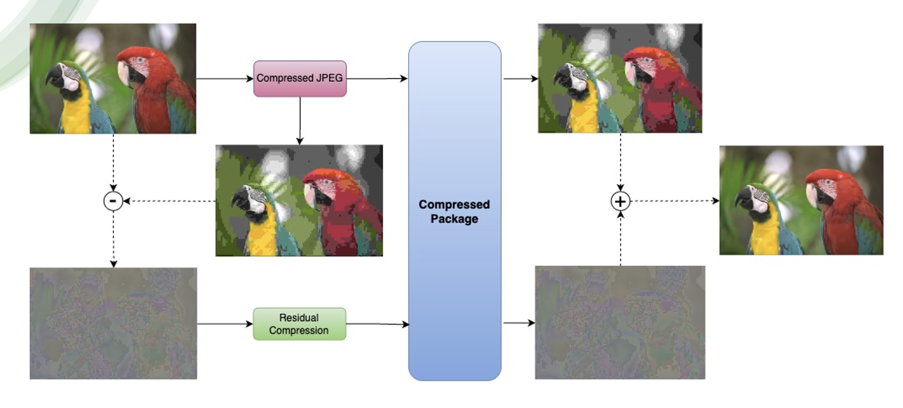
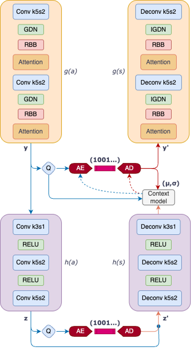
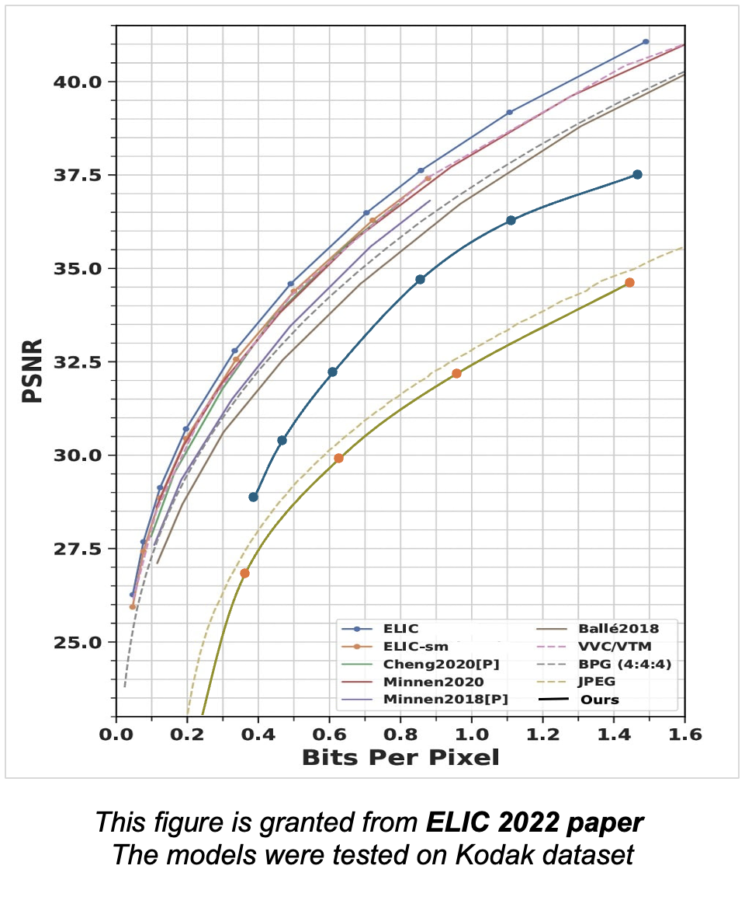

# HyRES: Residual-Enhanced Hybrid Image Compression

HyRES compresses an image with a very low-quality JPEG, then uses a small neural codec to compress only what JPEG got wrong (the residual). The result looks much better than JPEG at similar bitrates and encodes and decodes far faster than fully neural codecs.

Authors: Minh Khang Tran, Dinh Hoang Dai.

<p align="center">
  
</p>

## Contents

1. [Why](#why)
2. [How it works](#how-it-works)
3. [Results](#results)
4. [Repository layout](#repository-layout)
5. [Setup](#setup)
6. [Reproduce the experiments](#reproduce-the-experiments)
7. [Known limitations](#known-limitations)
8. [Future work](#future-work)
9. [Citation and license](#citation-and-license)

## Why

- JPEG degrades badly at low bitrates (blocking, color banding).
- Fully neural codecs fix this but are large, slow and need big GPUs.
- Goal: keep JPEG's speed and compatibility, add neural quality on top, and train on a modest machine (one NVIDIA A40, 16 GB GPU memory, 32 GB RAM) with a small dataset (Mini-ImageNet, 60k images, 7 GB).

## How it works

```
Encoder                                              Decoder
image --> JPEG (quality 1) --> JPEG bytes ---+---------> decode JPEG ----+
  |                                          |                           (+) --> refine --> output
  +--(minus decoded JPEG)--> residual --> neural residual codec --> decode residual
```

1. Compress the image with JPEG at quality 1 (TurboJPEG, runs on CPU).
2. Decode that JPEG and subtract it from the original to get the residual map.
3. Compress the residual with a lightweight learned codec (10.14M parameters).
4. Store both bitstreams in one package. The decoder adds the decoded residual to the decoded JPEG and applies a small refinement network that removes leftover blocking.

Total bitrate is `JPEG bpp + residual-latent bpp (y) + hyper-latent bpp (z)`. If the neural part is skipped, the JPEG alone is still a valid image.

<p align="center">
  
</p>

### Residual codec

The codec is a hyperprior autoencoder (`N=128`, `M=192`) combining pieces from three papers:

- GDN / inverse GDN activations (Balle et al., 2018, scale hyperprior).
- Attention modules and residual bottleneck blocks (Cheng et al., 2020).
- A checkerboard context model that decodes the latent in 2 parallel passes instead of one slow autoregressive pass (He et al., 2021).

<p align="center">
  
</p>

### Refinement network

`MultiScaleRefine` (`models/layers/enhancement.py`) takes the summed reconstruction and predicts a correction: a squeeze-and-excitation block, three dilated-conv branches at full, 1/2 and 1/4 resolution, spatial attention, and a fusion conv. Its output is added back to the reconstruction.

### Loss and training strategy

Rate-distortion loss: `loss = bpp + lambda * MSE` (an optional VGG perceptual term, weight `alpha`, is off in the reported runs).

The model is trained in six phases. High lambda first (learn to reconstruct), then lambda is lowered each phase to shift toward lower bitrate. Each phase starts from the best checkpoint of the previous one.

- First phase, trained from scratch: noise-based quantization during early epochs, then straight-through rounding (STE).
- Later phases (`--pretrained`): STE rounding from the start and `ReduceLROnPlateau`.
- Refinement is trained last, with the phase-6 checkpoint frozen.

## Results

Evaluation set: Kodak (24 full images, 768x512). Training set: Mini-ImageNet. JPEG quality 1 throughout.

### Verified: Phase 1 checkpoint, real bitstream

Measured with `scripts/evaluate.sh` on the released Phase 1 weights (lambda = 0.045, epoch 400, no refinement). The bpp here is the actual size of the JPEG bytes plus the entropy-coded residual, and the decoded image equals the model's forward-pass output exactly.

| Method | bpp | PSNR | MSE (0-255) | MS-SSIM |
|--------|----:|-----:|------------:|--------:|
| JPEG only (quality 1) | 0.203 | 21.54 dB | 476.66 | - |
| **HyRES Phase 1** | **1.563** | **37.41 dB** | **12.15** | **0.989** |

Bitrate split: JPEG 0.203 + residual latent y 1.332 + hyper-latent z 0.028 bpp. Coding time on a laptop CPU is about 0.75 s to encode and 0.75 s to decode per image, residual codec only.

### As reported during the project: all phases

These numbers come from the final presentation and could not be re-measured, because only the Phase 1 weights survive. They were computed during training, from the model's rate estimate on center crops, not from real bitstreams. That estimate had a bug (see [Code fixes](#code-fixes-after-the-project)). For Phase 1 the estimate said 1.465 bpp, against 1.563 bpp measured above, so treat the bpp column as indicative only. The MSE values are not affected by the bug.

| Phase | lambda | Best epoch | bpp (estimated) | MSE (0-255) |
|-------|--------|-----------:|------:|------:|
| JPEG only (quality 1) | - | - | 0.2028 | 476.66 |
| 1 | 0.045 | 400 | 1.465 | 11.76 |
| 2 | 0.032 | 41 | 1.109 | 15.72 |
| 3 | 0.016 | 6 | 0.852 | 22.89 |
| 4 | 0.008 | 51 | 0.604 | 41.28 |
| 5 | 0.004 | 13 | 0.460 | 63.79 |
| 6 | 0.002 | 17 | 0.380 | 91.61 |
| 6 + refinement | 0.002 | - | 0.380 (refinement adds no bits) | 84.69 (evaluation set not stated) |

Lower lambda gives fewer bits and higher distortion, so the phases trace a rate-distortion curve.

### Code fixes after the project

Re-measuring the Phase 1 weights exposed three bugs, now fixed in `models/checkerboard.py`. None of them needs retraining.

1. **Decoded residual was clamped to [0, 1].** Residuals are signed, so every negative correction was lost: real decoding gave 24.46 dB instead of 37.41 dB.
2. **Each checkerboard half was entropy-coded as a full-size tensor**, spending bits on the other half's empty positions: 1.878 bpp instead of 1.563 bpp. Each pass now codes only its own positions.
3. **The training rate estimate scored each latent with the sum of both halves' entropy parameters.** No decoder has that distribution, so the estimate was optimistic: 1.279 bpp on full Kodak images against 1.563 real. It now uses each position's own parameters and gives 1.666 bpp, a slight over-estimate. Models trained before this fix optimized the old, wrong rate term, so retraining should give a better rate-distortion trade-off.

### Speed

Measured during the project on the same VM (A40) for all models, before the bitstream fixes below, in seconds per image:

| Model | Parameters | Encode | Decode | Total |
|-------|-----------:|-------:|-------:|------:|
| Balle 2018 hyperprior | - | 0.22 | 0.24 | 0.46 |
| Joint Autoregressive + Hierarchical Priors (2018) | 14.13M | 2.85 | 3.74 | 6.59 |
| Cheng 2020 | 13.18M | 3.57 | 6.56 | 10.31 |
| ELIC (2022) | 33.79M | 4.31 | 4.54 | 8.85 |
| **HyRES** | **10.14M** | 0.476 | 0.286 | **0.762** |

HyRES encode is slower than decode because the JPEG step runs on CPU.

### Quality versus other codecs

<p align="center">
  
</p>

The teal curve with six points is HyRES, one point per lambda phase, plotted at the estimated bpp from the table above. The verified Phase 1 point sits further right, at 1.563 bpp and 37.41 dB. It is clearly above JPEG (dashed tan) but several dB below the best learned codecs (ELIC, Cheng 2020, Minnen). The curves of the published codecs are reproduced from the ELIC paper; the olive curve is not named in the legend and its origin is not documented. The trade is quality for speed and a much smaller training budget.

## Repository layout

```
models/
  hyres.py                 ResidualJPEGCompression: JPEG + residual codec + refinement
  checkerboard.py          LightWeightCheckerboard: the residual codec used by HyRES
  elic.py, cheng2020.py    Reference baselines (not used by HyRES training or inference)
  layers/                  attention, checkerboard masked conv, MultiScaleRefine
  utils/                   JPEG wrappers (TurboJPEG, PIL) and quantizer
src/
  training.py              Train one lambda phase
  refine_training.py       Train the refinement network (base model frozen)
  updata.py                Export a checkpoint with rebuilt entropy-coder CDFs
  inference.py             Real compress/decompress + metrics (bpp, MSE, PSNR, times)
  refine_inference.py      Inference with a separately trained refinement checkpoint
  losses/                  Rate-distortion loss, VGG perceptual loss
  utils/                   Datasets, training loops, optimizers, checkpoints
scripts/                   Thin shell wrappers, one per step (see below)
data/
  test/                    Kodak images (24 PNGs), used for validation and evaluation
  train/                   Mini-ImageNet images (downloaded, not tracked)
  reorganize.py            Flattens the downloaded dataset into data/train
assets/                    Figures used in this README
checkpoint/                Training outputs (not tracked)
```

## Setup

Requirements: Python 3.10+, a CUDA GPU for training (CPU or Apple MPS works for inference), and the native TurboJPEG library.

```bash
# Native library: Linux
sudo apt-get install libturbojpeg
# Native library: macOS
brew install jpeg-turbo
# Native library: Windows: install libjpeg-turbo from https://libjpeg-turbo.org

python -m venv .venv
source .venv/bin/activate        # Windows: .venv\Scripts\activate
pip install -r requirements.txt
```

Download the training data (needs Kaggle credentials in `~/.kaggle/kaggle.json`, in `./kaggle.json`, or in `KAGGLE_USERNAME` / `KAGGLE_KEY`; never commit them):

```bash
pip install kaggle
bash scripts/setup_data.sh
```

This fills `data/train`. `data/test` already contains Kodak.

## Reproduce the experiments

All steps run from the repository root. Each script prints its usage if called without arguments.

**1. Train the six lambda phases.** Replace `<E>` with the epoch of the best checkpoint written in the previous phase's folder.

```bash
bash scripts/train.sh 0.045 checkpoint/phase1
bash scripts/train.sh 0.032 checkpoint/phase2 checkpoint/phase1/checkpoint_best_loss_<E>.pth.tar
bash scripts/train.sh 0.016 checkpoint/phase3 checkpoint/phase2/checkpoint_best_loss_<E>.pth.tar
bash scripts/train.sh 0.008 checkpoint/phase4 checkpoint/phase3/checkpoint_best_loss_<E>.pth.tar
bash scripts/train.sh 0.004 checkpoint/phase5 checkpoint/phase4/checkpoint_best_loss_<E>.pth.tar
bash scripts/train.sh 0.002 checkpoint/phase6 checkpoint/phase5/checkpoint_best_loss_<E>.pth.tar
```

Defaults: batch 16 with 2 gradient-accumulation steps, patch 256x256, mixed precision, `EPOCHS=1000`, `LR=3e-4` (override with environment variables). TensorBoard logs go to each save folder (`tensorboard --logdir checkpoint`).

**2. (Optional) Train the refinement network** on the frozen phase-6 checkpoint:

```bash
bash scripts/train_refine.sh checkpoint/phase6/checkpoint_best_loss_<E>.pth.tar
```

**3. Export a checkpoint** (rebuilds entropy-coder tables, required for real bitstreams):

```bash
bash scripts/export.sh checkpoint/phase6/checkpoint_best_loss_<E>.pth.tar phase6
```

**4. Evaluate** on Kodak, or any image or folder:

```bash
bash scripts/evaluate.sh checkpoint/inference/phase6.pth.tar                 # Kodak
bash scripts/evaluate.sh checkpoint/inference/phase6.pth.tar my.png out/     # one image
```

This writes reconstructions, JPEG and residual visualizations, and `metrics.csv` (bpp split into JPEG / y / z, MSE, PSNR, encode and decode time) to the output folder.

## Known limitations

- Kodak is used both to pick the best checkpoint during training and to report results, so reported numbers are slightly optimistic. Use a separate validation split for a fair comparison.
- Only MSE-based training was run. Reconstructions are smooth but not perceptually sharp.
- Residual blocking is reduced by refinement but not removed (visible on zoomed crops).
- Quality is well below state-of-the-art learned codecs at equal bitrate.
- Image height and width must be multiples of 64 (the codec downsamples by 64). Kodak (768x512) satisfies this; pad other images first.
- Inference runs on CUDA or CPU. Apple MPS is not supported, because CompressAI's Gaussian likelihood needs an operator MPS lacks.
- The in-repo model (`models/hyres.py`) includes the refinement network inside the main model. The slides describe it as a separate stage trained afterwards on a frozen base. `scripts/train_refine.sh` follows the second flow.
- `src/inference.py` reports MS-SSIM only if `pytorch-msssim` is installed; otherwise it prints 0.

## Future work

1. VGG and GAN losses for perceptual quality: `loss = bpp + lambda * MSE + theta * VGG`.
2. Multi-scale blocks to handle blockiness at different scales.
3. Wavelet-based denoising blocks for small blocky edges.
4. A larger, more diverse training set for better generalization.

## Citation and license

No paper has been published. If you use this code, cite the repository:

```bibtex
@misc{hyres,
  title  = {HyRES: Residual-Enhanced Hybrid Image Compression},
  author = {Tran, Minh Khang and Dinh, Hoang Dai},
  howpublished = {\url{https://github.com/tmkhang1999/HyRES-Residual-Enhanced-Hybrid-Image-Compression}}
}
```

Apache License 2.0, see [LICENSE](LICENSE).
