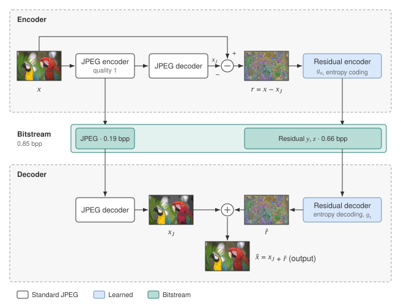
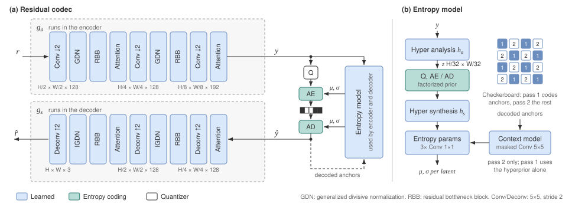
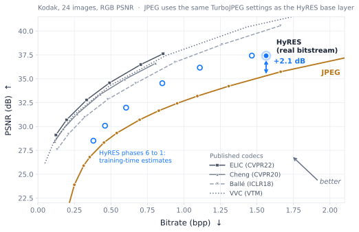
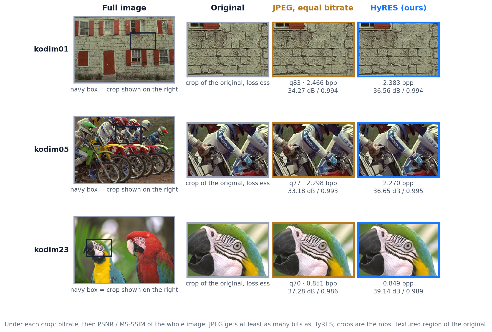

<div align="center">

# HyRES: Residual-Enhanced Hybrid Image Compression

**Minh Khang Tran, Dinh Hoang Dai** &middot; Course research project, 2025

[](https://tmkhang1999.github.io/HyRES-Residual-Enhanced-Hybrid-Image-Compression/)
[](LICENSE)
[](https://github.com/InterDigitalInc/CompressAI)



</div>

**Figure 1.** HyRES stores a quality-1 JPEG plus a learned code for the residual *r* = *x* - *x*<sub>J</sub>, the part the JPEG got wrong. The decoder adds the decoded residual back. Thumbnails and bitrates are real outputs of the released model on Kodak image 23 (residuals amplified 2x); averaged over Kodak the total is 1.56 bpp.

## Overview

JPEG is fast and supported everywhere but loses detail at low bitrates; learned codecs compress far better but are large, slow and unreadable by standard viewers. HyRES keeps a standard JPEG as the base layer and uses a small learned codec (10.14M parameters) only for the residual, so every file still contains a valid JPEG. On Kodak it reaches **37.41 dB at 1.563 bpp, 2.1 dB above JPEG at the same file size**, in about 0.76 s per image on one GPU. State-of-the-art learned codecs are still more efficient (ELIC reaches the same quality at about half the bits); HyRES trades some efficiency for a small, fast and backward-compatible codec.

<details>
<summary><b>Terms</b></summary>

- **bpp** (bits per pixel): file size in bits divided by the number of pixels; lower is smaller.
- **PSNR** (dB): reconstruction quality from the mean squared error; higher is better.
- **Rate-distortion (RD)**: the trade-off between file size and error; a better codec has a higher RD curve.
- **lambda**: weight in the training loss `bpp + lambda * MSE`; each lambda gives one model at one bitrate.
- **Entropy coding**: lossless arithmetic coding (AE encodes, AD decodes) of quantized values using predicted probabilities; better predictions mean fewer bits.
- **Hyperprior**: a few extra bits (*z*) that tell the decoder how to predict the main latent (*y*).

</details>

## Method

<p align="center">
  
</p>

**Figure 2.** The residual codec. (a) The analysis transform *g*<sub>a</sub> maps the residual to a latent *y* at 1/8 resolution, which is quantized and arithmetic-coded; the synthesis transform *g*<sub>s</sub> maps the decoded latent back. (b) The entropy model predicts a mean and scale for every latent from a hyperprior ([Balle et al., ICLR 2018](https://arxiv.org/abs/1802.01436)) and a checkerboard context model that decodes in two parallel passes ([He et al., CVPR 2021](https://arxiv.org/abs/2103.15306)). Attention and residual bottleneck blocks follow [Cheng et al., CVPR 2020](https://arxiv.org/abs/2001.01568).

**Training.** Loss `bpp + lambda * MSE` on Mini-ImageNet (60k images), 256x256 crops, one NVIDIA A40. Training runs in phases: a high lambda (0.045) first so the model learns to reconstruct, then lambda is lowered step by step down to 0.002, each phase starting from the previous best checkpoint.

## Results

Kodak (24 images, 768x512), RGB PSNR averaged per image. All HyRES numbers are measured from real bitstreams.

<p align="center">
  
</p>

**Figure 3.** Rate-distortion on Kodak. The star is the released model; hollow circles are the training-time estimates of all six phases (not real bitstreams). JPEG uses the same settings as the HyRES base layer. Published codecs are from [CompressAI's benchmark results](https://github.com/InterDigitalInc/CompressAI/tree/master/results/image/kodak).

Bitrate each codec needs to reach the HyRES quality (37.4 dB on Kodak), interpolated from the RD curves:

| Method | bpp at 37.4 dB | Params | Encode + decode (s) |
|--------|---------------:|-------:|--------------------:|
| JPEG (TurboJPEG) | 2.17 | - | - |
| **HyRES** | **1.56** (-28% vs JPEG) | **10.1M** | **0.76** |
| Balle (ICLR18) | 1.06 | - | 0.46 |
| VVC (VTM) | 0.87 | - | - |
| ELIC (CVPR22) | 0.83 | 33.8M | 8.85 |
| Cheng (CVPR20) | curve ends at 36.6 dB | 13.2M | 10.13 |

Times are per Kodak image on one A40. For HyRES, most bits (1.36 of 1.56 bpp) go to the residual, so the gain over JPEG comes from coding those bits more efficiently.

<p align="center">
  
</p>

**Figure 4.** Visual comparison at equal bitrate: JPEG gets the lowest quality whose file is at least as large as the HyRES file, and each crop is the most textured region of the original. An interactive comparison is on the [project page](https://tmkhang1999.github.io/HyRES-Residual-Enhanced-Hybrid-Image-Compression/).

## Pretrained model

| Model | lambda | Kodak bpp | Kodak PSNR | Download |
|-------|-------:|----------:|-----------:|----------|
| HyRES Phase 1 | 0.045 | 1.563 | 37.41 dB | Coming soon (GitHub Release) |

## Quick start

Requires Python 3.10+ and the TurboJPEG library (`apt install libturbojpeg`, `brew install jpeg-turbo`, or [libjpeg-turbo](https://libjpeg-turbo.org) on Windows). Inference runs on CUDA or CPU.

```bash
pip install -r requirements.txt

# Export the checkpoint once (builds the entropy-coder tables), then encode + decode
bash scripts/export.sh path/to/checkpoint_best_loss_400.pth.tar phase1
bash scripts/evaluate.sh checkpoint/inference/phase1.pth.tar my_image.png out/
```

`out/` receives the reconstruction and a `metrics.csv` with the real bitrate (JPEG, *y* and *z* parts), PSNR, MS-SSIM and timing. Image sides must be multiples of 32. Without an image argument, `evaluate.sh` runs on all of Kodak.

## Training

```bash
bash scripts/setup_data.sh                       # Mini-ImageNet -> data/train (needs Kaggle credentials)
bash scripts/train.sh 0.045 checkpoint/phase1    # phase 1 from scratch
i=1
for lmbda in 0.032 0.016 0.008 0.004 0.002; do   # each phase starts from the previous best
  prev=$(ls checkpoint/phase$i/checkpoint_best_loss_*.pth.tar); i=$((i+1))
  bash scripts/train.sh $lmbda checkpoint/phase$i "$prev"
done
```

Every script prints its options when run without arguments. An optional post-filter (`scripts/train_refine.sh`) can be trained on the final phase; the released model does not use it. The figures above are rebuilt by the scripts in `tools/figures/`.

## Limitations

- Only the Phase 1 model is verified from real bitstreams. A full RD curve and BD-rate against VVC need the other lambdas retrained; the project page lists the training-time estimates and the codec fixes found while re-measuring.
- Kodak was also used to select checkpoints, so it is not a fully held-out test set.
- Training uses MSE only, so reconstructions are smooth rather than perceptually sharp. Perceptual losses (VGG, GAN) and a larger training set are the natural next steps.

## Citation

```bibtex
@misc{hyres2025,
  title        = {HyRES: Residual-Enhanced Hybrid Image Compression},
  author       = {Tran, Minh Khang and Dinh, Hoang Dai},
  year         = {2025},
  howpublished = {\url{https://github.com/tmkhang1999/HyRES-Residual-Enhanced-Hybrid-Image-Compression}}
}
```

Built on [CompressAI](https://github.com/InterDigitalInc/CompressAI). Kodak images by Eastman Kodak. Apache 2.0 license.
