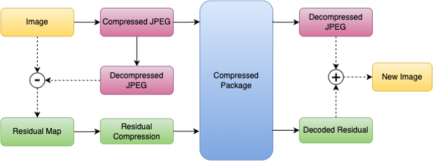

# HyRES: Residual-Enhanced Hybrid Image Compression

HyRES is a hybrid image compression framework that combines traditional JPEG compression with neural network-based residual compression. This approach achieves superior compression efficiency while maintaining high image quality.

<p align="center">
  
</p>

## Key Features

- **Hybrid Compression**: Combines JPEG and neural compression for optimal rate-distortion performance
- **Residual Learning**: Focuses on compressing the difference between original and JPEG-compressed images
- **Multi-Scale Enhancement**: Uses a multi-scale refinement network to improve visual quality
- **Attention Mechanisms**: Incorporates both channel and spatial attention for better feature extraction
- **Checkerboard Pattern**: Implements efficient context modeling through checkerboard masking

## Architecture Overview

The framework consists of three main components:

1. **JPEG Compression**: Traditional JPEG compression with configurable quality factor
2. **Residual Compression**: Neural network-based compression of the JPEG residual
3. **Multi-Scale Refinement**: Post-processing network to enhance the final reconstruction

### System Pipeline

The diagram below illustrates how data flows through the HyRES compression pipeline:

<p align="center">
  
</p>

### Residual Compression Model Architecture

<p align="center">
  
</p>

The residual compression model features:
- **Analysis and Synthesis Transforms**: Convert images to/from latent representations
- **Hyperprior Network**: Estimates distribution parameters for entropy coding
- **Context Model**: Uses checkerboard pattern for efficient context modeling
- **Attention Blocks**: Enhance feature extraction through channel and spatial attention
- **Multi-Scale Refinement**: Post-processing network for quality enhancement

## Installation

1. Clone the repository:
```bash
git clone https://github.com/yourusername/HyRES-Residual-Enhanced-Hybrid-Image-Compression.git
cd HyRES-Residual-Enhanced-Hybrid-Image-Compression
```

2. Set up the environment:
```bash
chmod +x setup.sh
./setup.sh
```

## Usage

### Training

To train the model:

```bash
chmod +x train.sh
./train.sh
```

Key training parameters:
- `--dataset`: Path to training dataset
- `--N`: Number of channels in main codec (default: 128)
- `--M`: Number of channels in latent space (default: 192)
- `--jpeg-quality`: JPEG quality factor (default: 1)
- `--epochs`: Number of training epochs (default: 4000)
- `--learning-rate`: Learning rate (default: 1e-4)

### Inference

To compress and decompress images:

```bash
python src/inference.py \
    --input path/to/input/image.png \
    --output path/to/output/image.png \
    --model-checkpoint path/to/checkpoint.pth \
    --jpeg-quality 50
```

## Training Strategy

### Multi-Phase Training

We employ a multi-phase training approach to jointly optimize for both distortion (MSE loss) and rate (bits-per-pixel, bpp):

- **Phase 1**: Start with high Lagrangian multiplier (λ = 0.045), focusing on image quality
- **Subsequent Phases**: Gradually decrease λ to balance rate-distortion trade-off
- **λ Schedule**: 0.045 → 0.032 → 0.016 → 0.008 → 0.004 → 0.002

This staged reduction allows the model to first learn reconstruction, then progressively balance quality and compression rate.

### Refinement Training

For the refinement phase:
- Use pretrained checkpoint from final phase (λ = 0.002)
- **Freeze** main model weights during refinement
- Train only the refinement network for improved perceptual quality

## Performance

### Computational Efficiency ⏱️

| Model         | Encode Time (s) | Decode Time (s) | Total (s) |
|---------------|-----------------|-----------------|-----------|
| Model A (2018) | 0.22            | 0.24            | 0.46      |
| Model B (2018) | 2.85            | 3.74            | 6.59      |
| Cheng2020      | 3.57            | 6.56            | 10.31     |
| ELIC (2022)    | 4.31            | 4.54            | 8.85      |
| **Our HyRES**  | **0.476**       | **0.286**       | **0.762** |

### Performance Metrics

<p align="center">
  
</p>

## Loss Functions

The model uses a combination of:
- **Rate-Distortion Loss**: Balances compression rate and reconstruction quality
- **MSE Loss**: Pixel-wise reconstruction error
- **VGG Perceptual Loss**: Perceptual quality enhancement

## Project Structure

```
HyRES-Residual-Enhanced-Hybrid-Image-Compression
├── checkpoint/                # Model checkpoints directory
├── data/                      # Dataset directory
│   ├── train/                 # Training images
│   └── test/                  # Test images
├── models/                    # Model architecture definitions
│   ├── hyres.py               # ResidualJPEGCompression (HyRES main model)
│   ├── checkerboard.py        # LightWeightCheckerboard (residual model)
│   ├── layers/                # Custom neural network layers
│   │   ├── attention.py       # AttentionBlock
│   │   ├── checkerboard.py    # MaskedConv2d, CheckboardMaskedConv2d
│   │   ├── common.py          # conv1x1, conv3x3 helpers
│   │   └── enhancement.py     # MultiScaleRefine (refinement network)
│   └── utils/                 # Model utilities
│       ├── jpeg_compression.py  # JPEG compression/decompression module
│       └── quantization.py      # Quantizer class with noise and STE support
├── src/                      # Source code
│   ├── losses/               # Loss functions
│   │   ├── rd_loss.py        # RateDistortionLoss implementation
│   │   └── vgg16.py          # VGG-based perceptual loss
│   ├── utils/                # Training utilities
│   │   ├── checkpoint_utils.py  # Checkpoint management functions
│   │   ├── dataset_utils.py     # ImageFolder dataset implementation
│   │   ├── engine.py            # Training and testing loops
│   │   └── optimizers.py        # Optimizer configuration
│   ├── inference.py          # Model inference script
│   ├── training.py           # Main training script
│   ├── refine_training.py    # Refinement network training script
│   ├── refine_inference.py   # Refinement network inference script
│   └── updata.py             # Model update utilities
├── assets/                   # Visual assets and figures
├── requirements.txt         # Python dependencies
├── setup.sh                 # Environment setup script
├── train.sh                 # Training script
└── test.sh                  # Model testing script
```

## Citation

If you use this code in your research, please cite:

```bibtex
@article{hyres2024,
  title={HyRES: Residual-Enhanced Hybrid Image Compression},
  author={Your Name},
  journal={arXiv preprint},
  year={2024}
}
```

## License

This project is licensed under the Apache License 2.0 - see the [LICENSE](LICENSE) file for details.
